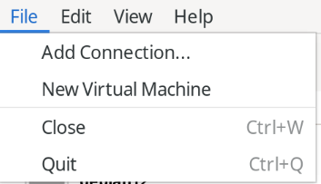
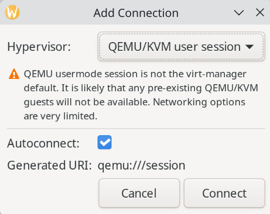

## Intro
Aurora OS is built on top of Universal Blue Project, which utilizes Fedora Kinoite as its base. Different from other general distros, they are built using Containerfiles and having updates delivered as OCI container images. With that being said, all updates are atomic and handled automatically, which means that you always get a functional desktop even if update fails.

**Q**: Why don't just enable -dx mode?
**A**: I wish to customize my workstation while avoid bloat as much as possible. I might automate this in foreseeable future through [BlueBuild](https://blue-build.org/)
## Steps
1. Install Aurora OS on your machine through: [Aurora OS](https://getaurora.dev/en/)
2. Note that we have 5 ways of installing a software. `brew`, `flatpak`, `distrobox`, `manually add to PATH`, `rpm-ostree layering`. 
3. I never installed apps in distrobox and export it to host before, not because it doesn't work, but it is quite troublesome to manage.
4. **Brew**: referring to [this link](https://github.com/ublue-os/homebrew-tap), I installed antigravity-ide-linux, antigravity-linux, jetbrains-toolbox-linux, vscodium-linux. Through jetbrains toolbox, i installed Android Studio and DataGrip for some conveniency.
5. **Flatpak**: All flatpaks can be downloaded through `Bazaar` application which is pre-installed.
   - Zotero
   - Steam
   - Virtual Machine Manager
   - OnlyOffice
   - OBS Studio
   - Obsidian
   - Discord
   - Brave Browser
   - Godot Engine
   
   The special part is virtual machine manager, I installed it through command line because I need to include some extensions. `flatpak install org.virt_manager.virt-manager org.virt_manager.virt_manager.Extension.Qemu`
   
   


Note that you need to choose `QEMU/KVM user session` for virtual machine to work. The rest steps to add a VM can be done by going through the GUI, so I won't blog that here. I don't know how to setup RDP by using this method. If you happen to need more functionality other than this, consider rpm-ostree layering instead.

6. **Manual**: I installed Rust, Nodejs, Golang and Devpod
7. Nodejs installation method: [source](https://nodejs.org/en/download): 
```bash
# Download and install nvm:
curl -o- https://raw.githubusercontent.com/nvm-sh/nvm/v0.40.5/install.sh | bash

# in lieu of restarting the shell
\. "$HOME/.nvm/nvm.sh"

# Download and install Node.js:
nvm install 24

# Verify the Node.js version:
node -v # Should print "v24.16.0".

# Verify npm version:
npm -v # Should print "11.13.0".

```
8. Rust installation method: [source](https://rust-lang.org/tools/install/): 
```bash
curl --proto '=https' --tlsv1.2 -sSf https://sh.rustup.rs | sh
```

9. Go installation method: [source](https://go.dev/doc/install)
First, download the tar.gz file from [here](https://go.dev/dl/) , then extract to ~/.local/bin
```bash
export PATH=$PATH:/var/home/hongye/.local/bin/go/bin  
source ~/.bashrc
```
10. (The following intro is generated by Gemini. It is correct)
[DevPod](https://devpod.sh/) is an open-source tool that allows you to spin up reproducible, containerized development environments on any infrastructure—whether that is your local machine, a Kubernetes cluster, or a cloud provider. It leverages the standard `devcontainer.json` specification to configure your workspace, ensuring your development environment remains consistent and identical across your entire team. 

Note: the following commands focuses on local use, and does not include a GUI.
```bash
# ~/.local/bin is included in $PATH by default in Aurora OS
mkdir -p ~/.local/bin
curl -L -o ~/.local/bin/devpod "https://github.com/loft-sh/devpod/releases/latest/download/devpod-linux-amd64"
chmod +x ~/.local/bin/devpod

# we will include steps to install docker later
# podman is preinstalled in the system, but docker is not
devpod provider add docker
devpod provider use docker

devpod use ide codium

# be sure that current directory contains a devcontainer.json file
devpod up .

# use the following if you want to rebuilt container
devpod up . --recreate
```

11. rpm-ostree layering to install docker (The following commands are searched online, executed myself, and commented by Gemini.)
```bash
# 1. Download the official Docker CE repository configuration for Fedora
sudo curl -Lo /etc/yum.repos.d/docker-ce.repo https://download.docker.com/linux/fedora/docker-ce.repo

# 2. Layer the Docker packages directly on Aurora OS
rpm-ostree install docker-ce docker-ce-cli containerd.io docker-buildx-plugin docker-compose-plugin

# 3. Apply changes immediately to the running system without reboot
sudo rpm-ostree apply-live --allow-replacement

# 4. Define a temporary variable for the group name
GROUP="docker"

# 5. Add current user to the newly created docker group for passwordless execution
sudo usermod -aG "$GROUP" "$USER"

# 6. Enable the Docker daemon to start automatically at boot and spin it up right now
sudo systemctl enable --now docker.service

# 7. Verify ostree deployment state and ensure your packages are successfully layered
rpm-ostree status
```


